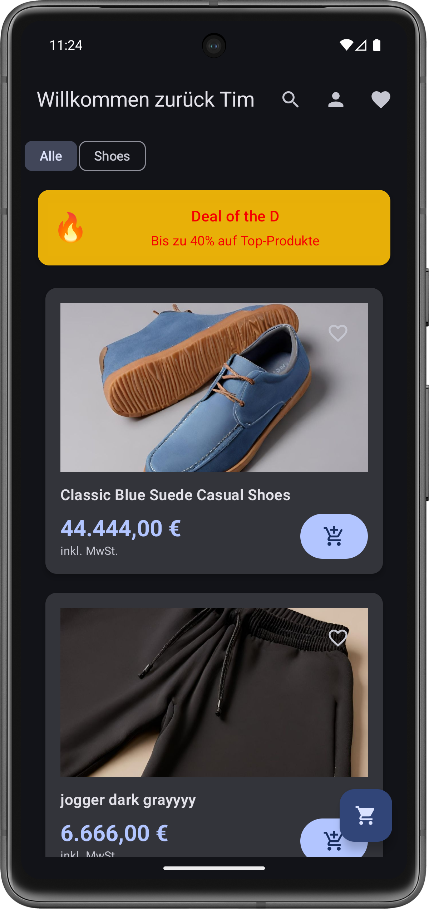
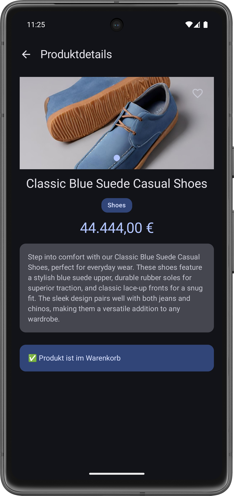
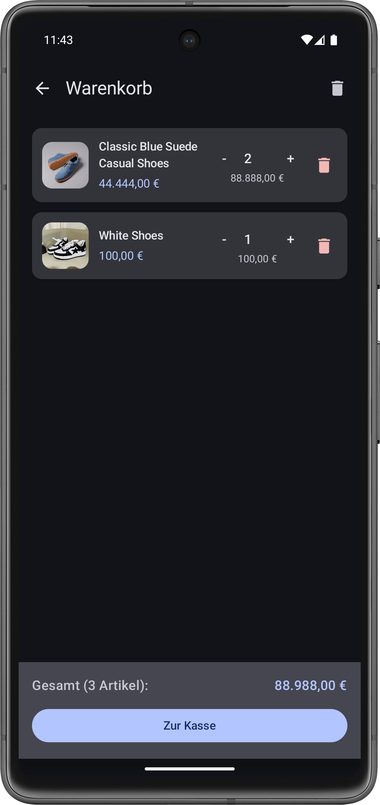
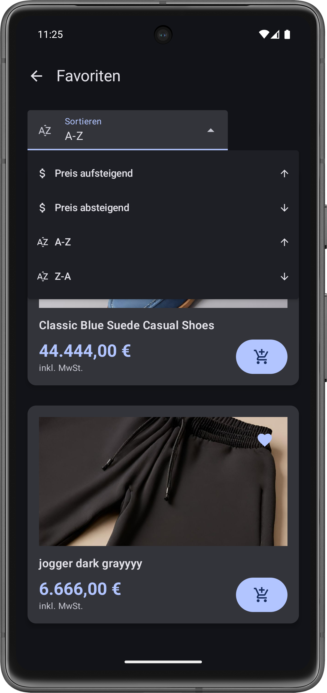
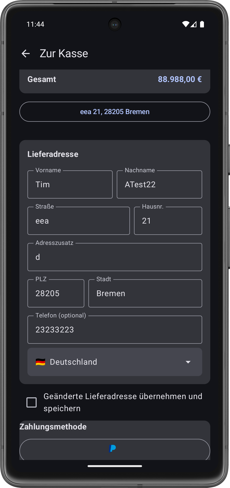
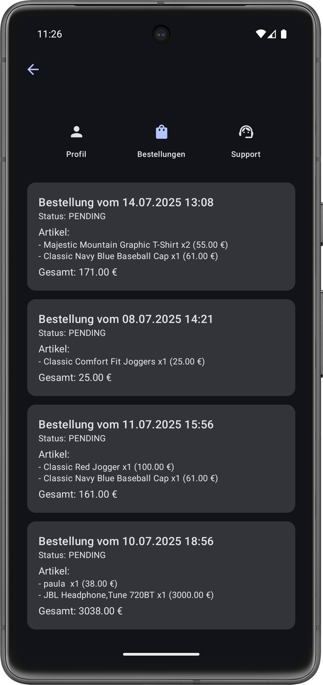

# 🛋️ Sofa-Shopper

**Get Your Stuff Now.**

---

## 📚 Inhaltsverzeichnis

1. [🛋️ Sofa-Shopper](#-sofa-shopper)  
2. [📝 Beschreibung](#-beschreibung)  
3. [🎨 Design](#-design)
   - [🖼️ Weitere Screens](#-weitere-screens)  
4. [✅ Features](#-features)  
5. [🛠️ Technischer Aufbau](#-technischer-aufbau)  
   - [🔧 Projektstruktur & Architektur](#-projektstruktur--architektur)  
   - [💾 Datenspeicherung](#-datenspeicherung)  
   - [🌐 API](#-api)  
   - [📦 Drittanbieter-Frameworks](#-drittanbieter-frameworks)  
6. [🛒 Einkauf & Bestand](#-einkauf--bestand)  
7. [🔮 Ausblick](#-ausblick)

---

## 📝 Beschreibung

**Sofa-Shopper** ist deine smarte Shopping-App für entspannte Einkaufserlebnisse vom Sofa aus.  
Egal ob Mode, Technik oder Lifestyle-Produkte – mit wenigen Klicks findest du genau das, was du brauchst.

Die App richtet sich an alle, die schnell, bequem und effizient shoppen wollen – ohne sich durch komplizierte Menüs kämpfen zu müssen.

> Ziel: **Intuitives Design, schlanker Bestellprozess, keine Ablenkung.**  
> Im Gegensatz zu anderen Shopping-Apps setzt Sofa-Shopper auf Übersichtlichkeit, einfache Bedienung und ein modernes Look-and-Feel.

---

## 🎨 Design

| Startseite | Produktansicht | Warenkorb |
|------------|----------------|-----------|
|  |  |  |

---

### Weitere Screens

| Favoriten | Zur Kasse | Bestellungen |
|-----------|-----------|--------------|
|  |  |  |

---

## ✅ Features

- [x] Produktliste mit Such- und Filterfunktion  
- [x] Detaillierte Produktansicht mit Bildern und Beschreibung  
- [x] Warenkorb mit Live-Preisberechnung  
- [x] Favoritenfunktion für Produkte  
- [x] Benutzerprofil mit Bestellübersicht  
- [x] Dark Mode  

---

## 🛠️ Technischer Aufbau

### 🔧 Projektstruktur & Architektur

Das Projekt folgt dem **MVVM-Pattern** und ist modular aufgebaut:

```
/ui          → alle Screens & Composables
/viewmodel   → zustandsbasierte Steuerung per StateFlow
/repository  → Vermittlung zwischen UI und Datenquelle
/data        → Modellklassen & API-Anbindung
```

> Diese Struktur sorgt für klare Trennung von Verantwortlichkeiten und einfache Testbarkeit.

---

### 💾 Datenspeicherung

- Aktuell: **temporäre In-Memory-Datenhaltung**  
- Zukünftig: Cloud-Sync via **Firebase Firestore**

---

### 🌐 API

Die Produktdaten stammen von der **[Fake Store API](https://fakeapi.platzi.com)**  
> Diese API bietet eine realistische Testumgebung für E-Commerce-Apps mit Produkten, Bildern, Preisen & mehr.

---

### 📦 Drittanbieter-Frameworks

- [Retrofit](https://square.github.io/retrofit/) – für Netzwerkaufrufe  
- [Koin](https://insert-koin.io/) – Dependency Injection  
- [Coil](https://coil-kt.github.io/coil/) – Bild-Loading  
- [Jetpack Compose](https://developer.android.com/jetpack/compose) – UI-Toolkit  

---

## 🛒 Einkauf & Bestand

Sofa-Shopper simuliert echte Kaufvorgänge inklusive:

- ✅ **Produktbestand**: Jeder Artikel hat eine begrenzte Menge im Lager.  
- ✅ **Kauf-Simulation**: Beim Kauf wird der Bestand reduziert.  
- ✅ **Lagerprüfung**: Artikel sind „ausverkauft“, wenn der Bestand auf 0 fällt.  
- ✅ **Warenkorb-Validierung**: Nur verfügbare Mengen können in den Warenkorb gelegt werden.  
- ✅ **Restbestand-Hinweis**: Anzeige „Nur noch X verfügbar!“ bei geringer Stückzahl.  

> Ziel ist eine realitätsnahe Shopping-Experience – auch für Tests, Prototyping & UI-Demonstrationen.

---

## 🔮 Ausblick

- [ ] Benutzer-Login mit Firebase Auth  
- [ ] Wunschzettel & Merklisten  
- [ ] Push-Benachrichtigungen bei Angeboten  
- [ ] Bestellverfolgung mit Tracking  
- [ ] Mehrsprachigkeit (DE/EN)  

---

**Made with ❤️ in Kotlin + Jetpack Compose**
